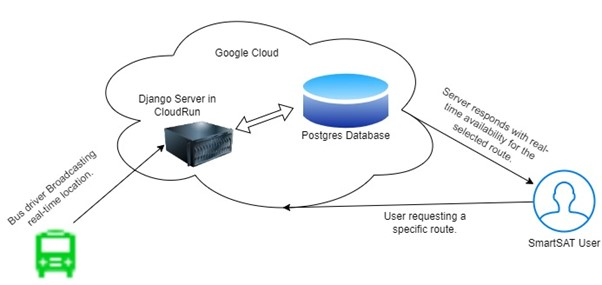
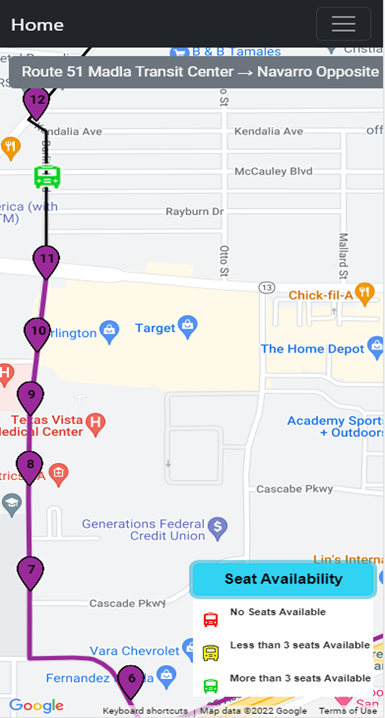

# Details about how major functionalities are implemented within the project [As of 08/08/2023]

---
Note: Used iPad Air screen resolution (820 x 1180) for taking driver UI related screenshots and iPhone 12 Pro screen resolution (390 x 844) for user related screen shots.
## A. Real time bus arrival
The below diagram shows the overall implementation of the real-time bus arrival implementation.



This functionality has two components.


## 1. The real time location broadcast from the bus driver
When a person registers with the SmartSAT system, they can do so either as a bus driver or as a rider. A bus driver is entitled access to a webpage in which they shall be able to select a route from a list of valid bus routes and enable the sending of their location to the server. Currently, their location shall be broadcasted to the server every 2 seconds. We are using the **navigator.geolocation.watchPosition** method to obtain location data, which is given as **latitude** and **longitude** coordinates. The watchPosition function also provides other data including approximate **speed**, the **accuracy** of the location coordinates, and **heading**. We bundle all this data together as shown below:

[ This code snippet is located in the file : **map/static/map/js/map_index.js** ]
```javascript
// Send the location information to the server
const posData = {
    'selected_route': routeSelect.val(),
    'active_bus_id': active_bus_id,
    'latitude': geolocationCoordinates.latitude,
    'longitude': geolocationCoordinates.longitude,
    'accuracy': geolocationCoordinates.accuracy != null ? geolocationCoordinates.accuracy : "",
    'speed': geolocationCoordinates.speed != null ? geolocationCoordinates.speed : "",
    'heading': geolocationCoordinates.heading != null ? geolocationCoordinates.heading : ""
}
```

This bundled data is sent to the server in JSON format via an AJAX call as shown below.

[ This code snippet is located in the file : **map/static/map/js/map_index.js** ]
```javascript
// Send the watchPosition data to the server
jQuery.ajax({
    url: "",
    data: {'posData': JSON.stringify(posData)},
    // ^the leftmost "data" is a keyword used by ajax and is not a key that is accessible
    // server-side, hence the object defined here
    type: "GET",
    dataType: 'json', // dataType specifies the type of data expected back from the server,
    success: (data) => {
        if (data['status'] === "Success") {
            active_bus_id = data['active_bus_id']
            // Update position data status message on page
            if (data['last_stop_idx'] !== 0) {
                statusMessageDiv.html(`<p> Bus Passed / Arrived stop : ${data['last_stop_idx']} - ${all_stops[data['last_stop_idx']-1].BusStopName} </p>`)
            }

        } else {
            active_bus_id = -1
            // Update position data status message on page
            statusMessageDiv.html(`${data['status']}`)
        }
    },
});
```
The url field of this AJAX call specifies a URL that has been setup on the server to receive HTTP requests from this specific AJAX call. A view function named bus_position_ajax has been setup on the server to process these requests and send data back to this AJAX call via the URL. When the view function receives the data, the following events happen (in order).
1. Extract the id of the bus driver from the request
2. Check that there exists a bus with matching bus driver id in the buses table
3. If no such bus object exists, create one
4. Set the latitude and longitude fields for the bus object according to the data from the request
5. Create a new log entry for the current request with the latitude and longitude details

This design ensures that the corresponding object in the buses table will always have the latest location information available to use.

## 2. Updating the Estimated arrival time in the Google Maps UI.
This functionality mainly relies on the buses table described in the previous section. This also can be seen as three parts

#### 2.1 First updating the bus markers on the map.
On the front-end, when a rider selects a route from the menu, a javascript function is executed that makes an AJAX call which sends to the server the ID number of the bus route that is currently selected. Also in the front-end is a **SetInterval** method that runs continuously and asynchronously that checks every 3 seconds if there is a route selected and executes that same function. In this way the server is queried either when the rider changes the selection of the dropdown or 3 seconds have elapsed since a selection has been made. The view function processing the data sent via this AJAX call is configured in the server as follows.

[ This code snippet is located in the file : **bus/views.py** ]
```python
def getActiveBussesOnRouteAJAX(request):
    # extract the data from the request
    user_data = ast.literal_eval(request.GET.get('data'))
    user_selected_route = user_data.get('route')

    # filter for all busses active on user-selected route
    busObjs = Bus.objects.filter(route=user_selected_route)

    # bus data to send back to client
    bus_data = {bus.id: {'selected_route': bus.route.pk, 'bus_lat': bus.latitude, 'bus_lng': bus.longitude,
                         'bus_color': bus.getBusColorStaticUrl()} for bus in busObjs}

    return HttpResponse(json.dumps(bus_data))

```
This function extracts from the HTTP request the bus route that the rider selected; it queries the database for a list of active buses on the route; it bundles together the following data: the id of the selected route and the locations and color codes of each bus; and it sends the bundled data back to the AJAX call in JSON format. When the AJAX call receives this data from the server, it executes a JavaScript function that removes all bus markers from the map and creates new markers using the data from the server.

#### 2.2  Showing the real-time arrival details on a particular bus stop
When a rider clicks a bus stop marker in the map, an estimated or scheduled arrival time data is displayed in a small window above the marker. The following screenshot illustrates this: 


The info window shown in this screenshot happens to display the scheduled arrival time, which shall be displayed if there are no buses currently operating on the route. Otherwise an estimated arrival time is displayed. On the front end, a javascript setInterval function executes every 5 seconds that checks for an open or active info window and updates its contents if so. The code is shown below.

[ This code snippet is located in the file : **map/static/map/js/map_index.js** ] 
```javascript
 setInterval(function () {

    if (activeMarkerInfoWindow.getMap() && activeMarkerObj) {
        console.log("Refreshing infowindow content.")
        activeMarkerObj.callBackMethod();
    } else {
        activeMarkerObj = null;
    }
}, 5000);
```
Because the application allows only one active info window object to be available in the map at a time, we are using the **activeMarkerObj** variable to store this object details in the global scope of the script. The following code shows the logic used to fetch the estimated or scheduled arrival time from the server and update the contents of the info window.

[ This code snippet is located in the file : **map/static/map/js/map_index.js** ]
```javascript
callBackMethod() {

    const toSend = {
        'route': this.routeId,
        'bus_stop_id': this.number,
        'calc_schedule': this.scheduled_arrival === defaultTimeString ? 1 : 0
    }
    jQuery.ajax({
        url: AJAX_URL_EST_ARRIVAL,
        data: {'data': JSON.stringify(toSend)},
        // ^the leftmost "data" is a keyword used by ajax and is not a key that is accessible
        // server-side, hence the object defined here
        type: "GET",
        //dataType: 'json', // dataType specifies the type of data expected back from the server,
        dataType: 'json',  // in this example HTML data is sent back via HttpResponse in views.py
        success: (data) => {
            if (data) {
                // console.log(data)
                if (data['est_arrival'] !== '') {
                    if (this.est_arrival === defaultTimeString) {
                        // Reset the scheduled arrival string. This scenario will happen if there were no buses available
                        // on the route when the info window was opened.
                        this.scheduled_arrival = defaultTimeString
                    }
                    this.est_arrival = data['est_arrival'];
                } else
                    this.est_arrival = defaultTimeString;

                if (data['scheduled_arrival'] !== '')
                    this.scheduled_arrival = data['scheduled_arrival']
            } else {
                this.est_arrival = defaultTimeString
                this.scheduled_arrival = defaultTimeString
            }


            // Refresh the info window
            this.refreshInfoWindow();
        },
    });

}
```
The selected route ID and bus stop ID is passed in the AJAX call to the server. The URL field specifies a URL that maps this AJAX call to a function on the server called **getEstimatedArrivalAJAX**.
What is happening in this function can be broken down as follows. This method first parses the input parameters as shown below.

[ This code snippet is located in the file : **bus/views.py** ]
```python
# extract data from request,  route and bus_stop ID
user_data = ast.literal_eval(request.GET.get('data'))
user_selected_route = user_data.get('route')
user_selected_bus_stop = user_data.get('bus_stop_id')
```
After parsing the input parameters, this function fetches the corresponding **busStop** and **bus** objects from the database using the above parameters.

[ This code snippet is located in the file : **bus/views.py** ]
```python
# get BusStop instance
busStop = BusRouteDetails.objects.get(parent_route=user_selected_route,
                                      bus_stop__stop_id=int(user_selected_bus_stop)).bus_stop
busStopCoord = busStop.getCoordinates()

# filter Bus models by route (for now)
# assumptions:  only one bus at anytime per route
bus = Bus.objects.filter(route=user_selected_route).first()  # TODO filter for multiple busses
```

Now, what value to return depends on whether there is an active bus on the route or not. The below code block will handle this scenario.
#### 2.2.1 When there is no active bus on route.

[ This code snippet is located in the file : **bus/views.py** ]
```python
dateTimeNow = datetime.now()
day_of_week = getScheduleDayOfWeekLetter(dateTimeNow)
next_arrival = BusSchedule.objects.filter(bus_route_id=user_selected_route, day_of_week=day_of_week,
                                          bus_stop=busStop,
                                          scheduled_time__gte=dateTimeNow.time().strftime('%H:%M:%S')).first()
if next_arrival is not None:
    result[
        'scheduled_arrival'] = f'{next_arrival.scheduled_time.strftime("%I:%M %p")} on {dateTimeNow.date().strftime("%B %d, %Y")}'
if bus is None:
    return HttpResponse(json.dumps(result))
```

When there is no active buses available on the route, application shows only the next scheduled arrival time. A list of bus schedules
for each bus stop is stored in the database. The **getScheduleDayOfWeekLetter** function is used to get the day of the week letter from the datetime object. This letter is used to filter the bus schedules for the current day of the week. The **next_arrival** variable stores the next scheduled arrival time for the bus stop. If there are no more buses scheduled for the day, then the **next_arrival** variable will be None. In this case, the function returns the **result** variable as a JSON object to the client. The client side code will then display the scheduled arrival time in the info window.
The bus object is also checked for None. If there are no active buses on the route, then the function returns the **result** variable as a JSON object to the client. The client side code will then display the scheduled arrival time in the info window.

#### 2.2.2 When there is active bus on route.
[ This code snippet is located in the file : **bus/views.py** ]

When there is active buses on the route, the below code block will handle this scenario. First, the coordinates of the bus and bus stop are passed to the **calc_duration** function. This function uses the Google Maps API to calculate the transit duration between the bus and bus stop. The **result** variable is then updated with the estimated arrival time. The **result** variable is then returned to the client side code as a JSON object.
```python
busCoord = bus.getCoordinates()
# send Bus obj coords and BusStop obj coords to dist matrix calc
travelDuration = calc_duration(busCoord, busStopCoord)
if 'duration' in travelDuration['rows'][0]['elements'][0].keys():
    result['est_arrival'] = travelDuration['rows'][0]['elements'][0]['duration']['text']

# return estimated arrival time result to user
return HttpResponse(json.dumps(result))

```

The calc_duration function is shown below. This function calls the distance_matrix method from the Google Maps API.

[ This code snippet is located in the file : **bus/views.py** ]
```python
def calc_duration(origin, dest):
    """
    Calculates transit duration between origin and dest. Meant for only one origin, one dest. Departure time default to current time.
    """
    response = distance_matrix(gmaps, origins=origin, destinations=dest,
                          transit_mode="bus", departure_time=datetime.now())
    # res['rows'][0]['elements'][0]['duration']
    return response
```
The above method does the actual calculation of getting the estimated travel time from point A to point B using the Googles Distance Matrix API FROM Python Client for Google Maps Services. From this Python library we use method distance_matrix. We pass it one origin and one destination. The origin passed to this method is as follows.

The origin passed is the current location of the bus. The destination passed is always the location of the bus stop that the user clicked. We specify the mode of transit as “bus” in the keyword argument “transit_mode”. We specify the departure time in the keyword argument “departure_time”. 
Google Maps Distance Matrix API automatically uses the appropriate VIA transit line between the origin and destination (This is true for most of our routes. But not guaranteed) and automatically accounts for traffic conditions. The Google Maps API result return the estimated travel time in minutes.

The info window will look like this if there is an active bus on the route.

 

#### 2.3 Drawing the route polyline based on the current bus location.

This functionality involved drawing the polylines on the map based on the current location of the bus. We configured then required colour for each route polyline in the database in as pre-data. Also, we load and store the polyline drawing details using Google Map's DirectionsService API. This is done as shown below.

[ This code snippet is located in the file : **bus/models.py** ]
```python
def getGmapsDirectionsServiceResult(self):
    """
    Returns an object representing a Google Map's DirectionsService API result.
    """
    origin_coords = self.first_stop.getCoordinates()
    dest_coords = self.last_stop.getCoordinates()
    res = directions(gmaps, origin=origin_coords, destination=dest_coords, mode="transit", transit_mode="bus")
    if not res:
        raise ValueError("DirectionsService API result is empty")
``` 

The directions method in this API accepts an origin and destination coordinates. Also, we specify the mode of transit as “bus” and mode as “transit”. This helps Google maps in returning the accurate transit data available. The result object contains a string member with encoded details of the polyline for that route along with the bounds for the same. We save these details to the corresponding route. This value will be later accessed by the front-end code to draw the lines on map. A similar setInterval logic is configured to redraw the map polylines on the front-end every 10 seconds.

[ This code snippet is located in the file : **map/static/map/js/map_index.js** ]
```Javascript
setInterval(function () {
    if (displayedRoute !== "" && busMarkers.length > 0) {
        console.log("Updating Polyline")
        reDrawPolyLineWithCurrentLocation(busMarkers[0].getPosition(), mapRoutePolylinePaths[displayedRoute]['polyline'])
    }
}, 10000);
```

The portion from the start bus stop till the current location of the bus will be shown in the colour that is configured in the database for that route.
The reDrawPolyLineWithCurrentLocation function is used to redraw the polylines on the map based on the current location of the bus. This function accepts the current location of the bus and the polyline details for the route as arguments. The polyline details for the route is stored in the mapRoutePolylinePaths object. This object is populated when the page is loaded. The reDrawPolyLineWithCurrentLocation function is shown below.

[ This code snippet is located in the file : **map/static/map/js/map_index.js** ]
```Javascript
const LOCATION_PROXIMITY = 50;

function reDrawPolyLineWithCurrentLocation(busLocation, mapRoutePolylinePath) {

    let arrayLen = mapRoutePolylinePath.length;
    let newIndex = -1;
    for (let i = startIndex; i < arrayLen; i++) {
        let distanceBetween = google.maps.geometry.spherical.computeDistanceBetween(busLocation, mapRoutePolylinePath[i])
        // console.log("Distance ----", val)
        if (distanceBetween < LOCATION_PROXIMITY) {
            // console.log("Found at index ---: ", i)
            newIndex = i + 1
            break
        }
    }

    if (newIndex !== -1 && newIndex > startIndex) {
        startIndex = newIndex

        poly.setMap(null)
        left.setMap(null)

        left.setPath(mapRoutePolylinePath.slice(0, startIndex))
        left.setOptions({strokeColor: mapRouteMarkers[displayedRoute][0].location_pin_color});
        left.setMap(map)

    }
}
```

An Index which is close to the current location of the bus is calculated. 
This is done by calculating the distance between the current location of the bus and each of 
the points in the polyline. If the distance between the current location of the bus and a 
point in the polyline is less than 50 meters, then that index is considered as the index of 
the polyline that is close to the current location of the bus. 
The polyline is then redrawn from the start of the route till the index 
that is close to the current location of the bus.

[//]: # (The following shows how the result looks in the actual application.)

[//]: # ()
[//]: # ([IMAGE POLYLINE – Without an active Bus] TODO: Add image)

[//]: # ( )
[//]: # ([IMAGE POLYLINE – With an active Bus] TODO: Add image)

The complete list of events happening in order to show the updated arrival time in an info window is as follows.

1. User clicks on a bus stop. (This will open an infor window for that bus stop. Each info window
 has a callback function that is called when the info window is opened. This callback function
  is responsible for showing the arrival time in the info window. This callback function is
invoked every 5 seconds to get the updated arrival time from the server.)
2. The front-end code sends an AJAX request to the server to get the arrival time for the bus stop (This is the call back method mentioned in the previous step).
3. The server code checks if there is an active bus on the route.
4. If there is an active bus on the route, then the server code calls the Google Distance matrix API passing the 
      Current location of the bus and the location of the bus stop to get the estimated travel time
5. The server code returns the estimated travel time to the front-end code.
6. If there is no active bus on the route, then the server code returns the scheduled arrival time of the bus to the front-end code.
3. The front-end code displays the arrival time in the info window.
 

## 3. Bus Capacity with limited seats
This feature allows the rider to see how many open seats there are on a bus. This is indicated by the color of the bus’s icon on the map. **Green** means there are more than 3 seats available. **Yellow** means there are less than 3 seats available. **Red** means there are no seats available. This is described in a collapsible legend box on the bottom right-hand corner of the map as shown in the following screenshots.
 	 
  

A simple UI has been implemented for bus drivers to update the status of their seat availability. The UI Is as shown below.


The bus driver shall use these buttons to indicate their seat availability status at any time they wish while they are broadcasting their location. When a bus driver begins their location broadcast, their bus icon shall appear on the map as the green bus icon by default. No action is required of the driver for this to happen, it is done automatically. 
This functionality is implemented programatically in the following manner. 
We store 3 .png files containing the red, green, and yellow bus icons in a storage space within our project. The names of these files are green_bus.png, yellow_bus.png, red_bus.png. The naming convention of these files is important. We created a field within our buses table named seat_availability to store a string indicating the current occupancy status. It shall be “green”, “yellow”, or “red”. Each seat-availability button in the UI when pressed executes an AJAX call that sends to the server the ID of the bus driver and the color code string corresponding to the pressed button. The color code is either “green”, “yellow”, or “red”. This AJAX call maps to the following function on the server, updateBusSeatAvailabilityAJAX.

[ This code snippet is located in the file : **map/views.py** ]
```Python
@login_required
@permission_required('bus.access_busdriver_pages', raise_exception=True)
def updateBusSeatAvailabilityAJAX(request):
    data = ast.literal_eval(request.GET.get('data'))
    btn_data = data.get('choice')

    bus = Bus.objects.filter(driver=request.user.username).first()
    if bus:
        bus.seat_availability = btn_data
        bus.save()

    return HttpResponse("Success")
```

This function gets from the database the bus object matching the bus driver’s ID and updates the seat_availability field of the bus object with the color code string. A function mentioned earlier, getActiveBussesOnRouteAJAX, which sends bus data back to the front-end, invokes a method called getBusColorStaticUrl on each bus object. This method generates a url to one of the 3 bus icon .png files using the seat_availability string value. In the front-end, the function that deletes and creates new bus markers to display on the map, updateBusMarkers, passes the url string to Google’s method that creates map markers. The following are screenshots of getActiveBussesOnRouteAJAX and updateBusMarkers.

[ This code snippet is located in the file : **map/views.py** ]
```Python
def getActiveBussesOnRouteAJAX(request):
    # extract the data from the request
    user_data = ast.literal_eval(request.GET.get('data'))
    user_selected_route = user_data.get('route')

    # filter for all busses active on user-selected route
    busObjs = Bus.objects.filter(route=user_selected_route)

    # bus data to send back to client
    bus_data = {bus.id: {'selected_route': bus.route.pk, 'bus_lat': bus.latitude, 'bus_lng': bus.longitude,
                         'bus_color': bus.getBusColorStaticUrl()} for bus in busObjs}

    return HttpResponse(json.dumps(bus_data))
```

[ This code snippet is located in the file : **map/static/map/js/map_index.js** ]
```javascript
function updateBusMarkers(data) {

    for (let i = 0; i < busMarkers.length; i++) {
        busMarkers[i].setMap(null);
    }

    busMarkers = [];

    for (const busID in data) {
        const busData = data[busID]

        const busLatLng = new google.maps.LatLng(busData.bus_lat, busData.bus_lng);

        const iconWidth = 100  // pixels

        const busIcon = {
            url: busData.bus_color,
            scaledSize: new google.maps.Size(iconWidth, iconWidth),
            // rotationAngle: 0
        };

        let sidMarker = new google.maps.Marker({
            position: busLatLng,
            map: map,
            title: busID,
            icon: busIcon,
            optimized: false,
            zIndex: 99999999
        })

        busMarkers.push(sidMarker);
    }
}

```
The following images show the result of pressing the different buttons in the UI.
[Bus driver UI - GREEN]


[Map UI - GREEN]


 
[Bus driver UI - YELLOW]


 
[Map UI - YELLOW]


 
[Bus driver UI - RED]


 
[Map UI - RED]


 


### Rider Communications
We created a page in which riders may view announcements. Currently announcements shall be created only in the admin site (by administrators). When an announcement is created, it simultaneously will appear on the announcement page (viewable to the public) and is sent out to valid riders as an SMS text message. We use Twillio to make SMS text messages. 
The following is a screenshot of the publicly viewable announcements page.
 
The following is a screenshot of the code that sends the announcement as a SMS text message.


Currently valid riders are those with a non-empty phone number. Phone numbers are collected when a person registers a profile with the site. However, an admin can create a profile in the admin site, which has by default an empty string phone number.


The following is a DB schema visualization chart.


This diagram shows the different tables that are part of the application.
For the authentication part we are mainly using the authentication mechanism provided by django itself.
**user_profile** table is used to store the additional information about the user. and this is
the extra table created by us. This table used the auth_user table id as the foreign key.

The tables included as part of the light green box are the main tables used to store the bus and route related details.
The **bus_route** table is used to store information about all the bus routes part of the application. The **busstop** 
table is used to store the information about all the bus stops in each route. The bus_route and bussstop tables has a foreign key
relationship based on the route_id. The busstop has its own table because the same stop can be part of multiple routes. Due to this
another table named busroutedetails is created which has a foreign key relationship with both bus_route and busstop tables. This table
stores the details about which bus stops are part of the route and in what order.

The transitlog and transitlogentry are purely for the loging purposes. The bus table is used to store the realtime 
location and other application related information about all active buses currently running on the route.
Whenever a driver start a route, an entry will be made in this table. The location information about that bus will
get updated everytime the bus moves in a route. The entry will be removed from this table once the bus driver stops
driving the route.